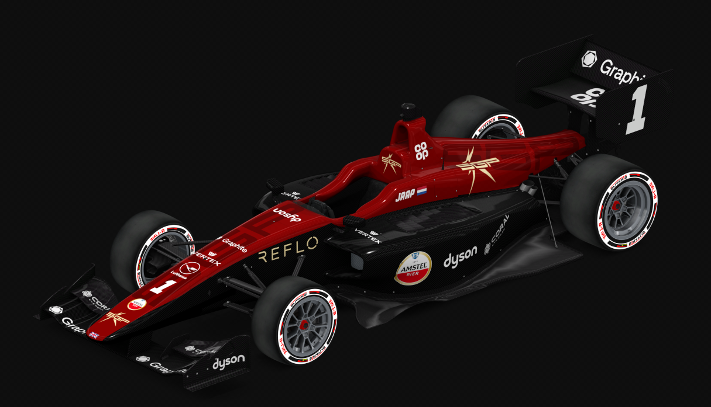

## The No. 1 is back

They may not have won the constructors last season, but they did make a statement by snatching the driver's championship at the final chance of asking.

Sonny Tate is a quiet individual, and upon an initial conversation you would find it mildly hard to believe his tales of success in sim racing. AFO was his first attempt of starting a team under his own name, Sonny GP, after owning several manufacturer teams across other leagues.

The results in his first season as owner? P2 in the constructors, and P1 in the drivers. Experienced Dutchman Jaap Wagenvoort beat title rival Auge Rimkunas at the final race in Monza by 10 points which saw him claim his first driver's title in AFO.

Many wondered if he would return to the grid after an extended period of media silence. However the doubts were soon cleared - and Jaap inked a new contract alongside rookie teammate Karim Yacoub, donning the number 1 on his Sonny GP car.

